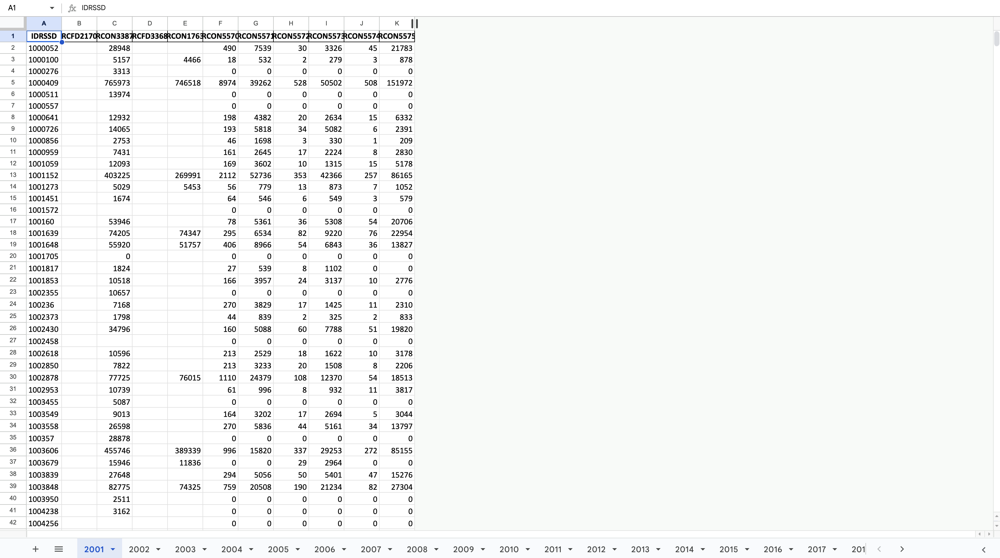

# URAP Prereq.

A prerequisite assignment for Prof. Matteo Benetton scraping specified variables from single call reports from 06/30/2001 to 06/30/2024 into an .xlsx file.

## Overview

This project processes FFIEC CDR Call Reports by extracting key variables from multiple schedules. For each year between 2001 and 2024, the script:

- Reads data files from designated directories following a standardized naming convention.
- Extracts specified variables from each schedule while retaining each bank's unique identifier (IDRSSD).
- Merges data from the various schedules on the IDRSSD column to create a consolidated table for that year.
- Exports the results to an Excel workbook with one sheet per year.

### Thought Process

- **File Structure and Naming Conventions:**  
  The code is designed to work with files organized in the following structure: 

  `data/FFIEC CDR Call All Schedules Jun 30 {Year}/FFIEC CDR Call Schedule {Schedule} {Quarter}{Year}.txt`

  For example, the file for schedule RCK in 2024 is:  

  `data/FFIEC CDR Call All Schedules Jun 30 2024/FFIEC CDR Call Schedule RCK 06302024.txt`

- **Variable Extraction:**  
  A dictionary (`VARIABLES`) maps each schedule (e.g., `RC`, `RCK`, `RCCI`, `RCCII`) to its respective variables and a brief description. The function `extract_yearly_vals` reads a given file, retains the `IDRSSD` and the specified variables, converts data to numeric (handling blanks), and returns a DataFrame.

- **Data Merging:**  
  For every year, the script loops through all schedules, merges the DataFrames on `IDRSSD` (using an outer join to ensure that all banks are included), and creates one unified table per year.

- **Output to Excel:**  
  The final merged tables for each year are written to an Excel workbook, with each sheet labeled by the corresponding year. This structure facilitates both a consolidated view and year-by-year analysis.

## Installation and Setup

### Prerequisites

- **Python 3.7 or later**
- The following Python packages:
  - `os`
  - `pandas`
  - `openpyxl`

### Installation Steps

1. **Clone the Repository:**  
   Clone or download the repository to your local machine.

```bash
git clone <repository_url>
cd <repository_directory>
```

2. Set Up a Virtual Environment (Optional but Recommended):
```bash
python -m venv venv
source venv/bin/activate   # On Windows use: venv\Scripts\activate
```

3. Install Required Packages:
```bash
pip install os pandas openpyxl
```

4. Directory Structure:
Ensure the data files are stored in the following directory structure:
```bash
├── src
│   └── urap.py
└── data
    ├── FFIEC CDR Call All Schedules Jun 30 2001
    │   ├── FFIEC CDR Call Schedule RC 06302001.txt
    │   └── ... (other schedule files)
    ├── FFIEC CDR Call All Schedules Jun 30 2002
    │   └── ...
    └── ... (up to 2024)
```

## Data Acquisition
Due to space constraints and best practices for version control, the data files are not included in this repository. You can bulk download the required call report files directly from the FFIEC website at: 

[https://cdr.ffiec.gov/public/PWS/DownloadBulkData.aspx](https://cdr.ffiec.gov/public/PWS/DownloadBulkData.aspx)

Dollow the file naming conventions described above when placing the `data` in your local data directory.

## Running the Script
To execute the script and generate the Excel file:
1. Navigate to the root directory of the project.
2. Run the script:
```bash
python src/urap.py
```
   - If running Python3:
   ```bash
   python3 src/urap.py
   ```

After running, you should see a file named `yearly_extracted_data.xlsx` in your project directory. Each sheet in this Excel workbook corresponds to a year, containing the extracted variables for each bank (identified by IDRSSD).

Result of data from 2001 using the specified variables (Opened in Google Sheets):


## Additional Notes
- Data Format:
The script assumes the text files are tab-delimited (`\t`). If the delimiter is different (e.g., a pipe character), adjust the `delimiter` parameter in the `pd.read_csv` call accordingly.

- Error Handling:
The script includes error messages for missing files or columns. Review the console output to troubleshoot any issues with the file structure or missing data.

- Modifications:
Feel free to adjust the VARIABLES dictionary if additional schedules or variables need to be processed.

- Documentation:
Inline comments in the code explain the purpose of each function and key steps in the processing workflow.

